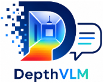
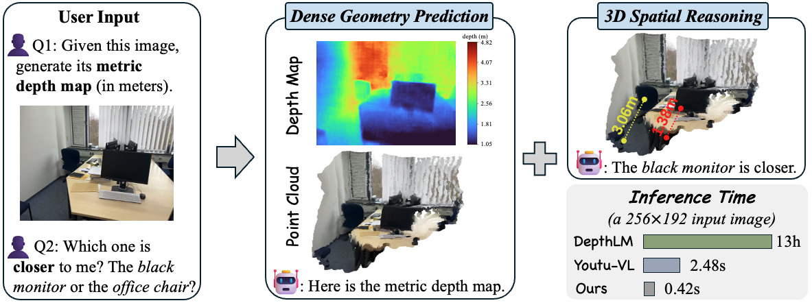
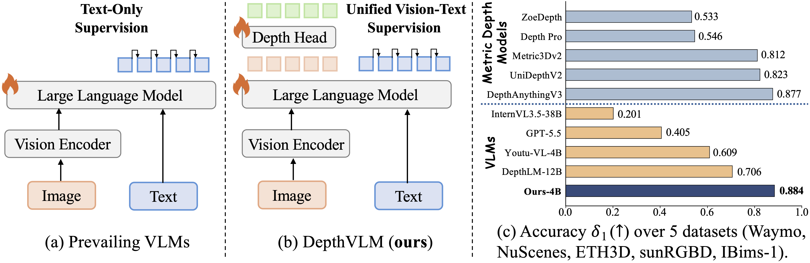
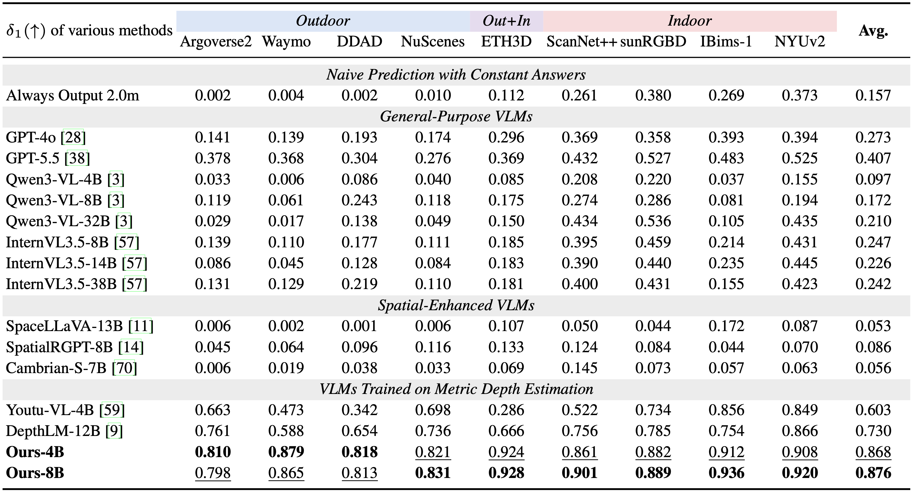
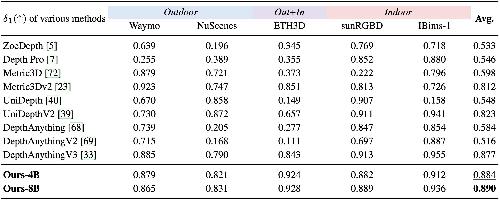

<h1 align="center">
  
  &nbsp;Unlocking Dense Metric Depth Estimation in VLMs
</h1>

<p align="center">
    <a href="https://hanxunyu.github.io/" target="_blank">Hanxun Yu<sup>1,2*</sup></a>,
    <a href="https://openreview.net/profile?id=%7EXuan_Qu1" target="_blank">Xuan Qu<sup>1,2*</sup></a>,
    <a href="https://w-ted.github.io/" target="_blank">Yuxin Wang<sup>2,3</sup></a>,
    <a href="https://person.zju.edu.cn/jkzhu" target="_blank">Jianke Zhu<sup>1,4</sup></a>,
    <a href="https://www.kelei.site/" target="_blank">Lei Ke<sup>2</sup></a>
    <br>
    <sup>1</sup>ZJU,
    <sup>2</sup>Tencent Hunyuan LLM,
    <sup>3</sup>HKUST
    <sup>4</sup>SLAI
</p>

<div align="center">
    <a href='https://arxiv.org/abs/2512.16561' target="_blank"></a>  
    <a href='https://depthvlm.github.io/' target="_blank"></a>  
    <a href='https://huggingface.co/JonnyYu828/DepthVLM-4B' target="_blank">
        
    </a>
    <a href='https://huggingface.co/datasets/JonnyYu828/DepthVLM-Bench' target="_blank">
        
    </a>
</div>


<p align="center">
  <video src="https://github.com/user-attachments/assets/772c15d7-2fac-4bbb-9874-112073feefe7"
         width="80%"
         autoplay
         muted
         loop
         playsinline
         controls>
    Your browser does not support the video tag.
  </video>
</p>


## 🔍 Overview

<div align="left">

</div>
<br>
<div align="left">

</div>

**DepthVLM** serves as a unified foundation model for both low-level dense geometry prediction and high-level multimodal understanding, while achieving substantially faster inference compared with existing VLM-based approaches such as DepthLM and Youtu-VL.


## 📰 News
- [2026-05-20] 🔥 We release [DepthVLM-Bench](xxxx) in Hugging Face 🤗.
- [2026-05-20] 🔥 We release the checkpoint of [DepthVLM-4B](https://huggingface.co/JonnyYu828/DepthVLM-4B) in Hugging Face 🤗.
- [2026-05-20] 🔥 We release the training and inference code.
- [2026-05-20] 🔥 We release the [paper](xxxxx) of DepthVLM.


## 🛠️ Installation

```
git clone https://github.com/hanxunyu/DepthVLM.git
cd DepthVLM

conda create -n depthvlm python=3.10 -y
conda activate depthvlm
pip install -r requirements.txt
pip install flash-attn==2.6.3 --no-build-isolation
```
## 📊 Data Preparation
- Due to licensing restrictions, we are unable to directly release the curated data. Instead, we provide the full data curation pipeline for reproducibility. Please refer to [data_process.md](data_process/data_process.md) for detailed dataset-specific preparation instructions.
- We provide example images from ScanNetPP in the [demo_images](./demo_images) folder.
- We also release the curated annotations of [DepthVLM-Bench](https://huggingface.co/yuxinhk/N3D-VLM) on Hugging Face 🤗.

## 📦️ Pretrained models
We provide the pretrained model [DepthVLM-4B](https://huggingface.co/JonnyYu828/Stream3D-VLM) in Hugging Face 🤗. 


## 🤖 Inference Examples 

Run our example inference script to generate the predicted depth maps and 3D point clouds.
```
# visualization examples
bash visualize_demo.sh
```

Specify the dataset paths in [configs/eval_datasets.conf](configs/eval_datasets.conf) and run evaluation script for [DepthVLM-Bench](https://huggingface.co/yuxinhk/N3D-VLM).
```
bash eval/eval.sh
```


## 🚀 Training
Stage1: depth head-only training
```
# stage-1 
bash train/train-stage1.sh
```
Stage2: end-to-end fine-tuning
```
bash train/train-stage2.sh
```
[DepthVLM-4B](https://huggingface.co/JonnyYu828/Stream3D-VLM) is trained for two days on 80 NVIDIA H20 GPUs (96GB).


## 🔬 Experiment Results

### Comparison with VLMs
<div align="left">

</div>

### Comparison with pure vision models
<div align="left">

</div>

### Visualization Comparison
<div align="left">

</div>
<br>
<div align="left">

</div>
<br>
<div align="left">

</div>
<br>
<div align="left">

</div>

## 👏 Acknowledgements
We are grateful for the open-source contributions of other projects:
- [DepthLM](https://github.com/facebookresearch/DepthLM_Official)
- [Youtu-VL](https://github.com/TencentCloudADP/youtu-vl)
- [Qwen3-VL](https://github.com/QwenLM/Qwen3-VL)


## 🖊️ Citation

```BibTeX

```
